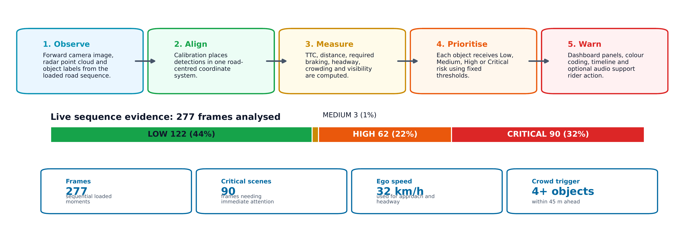

# Two-Wheeler Safety Dashboard

Browser dashboard for **two-wheeler road safety** research. It plays a KITTI-style camera + radar sequence, tracks nearby road users, and shows live risk metrics (TTC, brake demand, crowding, visibility) with optional audio alerts.


### Related projects

This dashboard is part of the **Road Safety on Two-Wheelers** research line:

| Repository | Role |
|------------|------|
| [RoadSafetyOnTwoWheelers](https://github.com/ibrahim-radwan/RoadSafetyOnTwoWheelers) | **Main project** — overall two-wheeler road safety research |
| [two-wheeler-radar-camera-annotation-tool](https://github.com/ibrahim-radwan/two-wheeler-radar-camera-annotation-tool/tree/main) | Annotation tool used to label camera + radar sequences that this dashboard plays back |

Annotated KITTI-style exports from the annotation tool (images, labels, calib, radar) are the intended input for `data_sample/`.

---

## Features

- Forward **camera** view with detection overlays  
- **3D radar** road view (point cloud + object boxes)  
- Risk levels: **LOW · MEDIUM · HIGH · CRITICAL**  
- Gauges: Min TTC, headway, required deceleration, stop margin, crowd  
- Object table, event log, rolling TTC / risk timeline  
- Optional **audio alerts** (beeps + browser speech) after Start Monitoring  
- Default data root: project-relative **`data_sample/`**

---

## Requirements

| Package | Used for |
|---------|----------|
| `dash` | Web UI and callbacks |
| `plotly` | Camera, radar, gauges, timeline charts |
| `flask` | Image route (`/frame-image/…`) |
| `numpy` | Radar / geometry / metrics |
| `Pillow` | Camera frames and weather cues |
| `pytest` | Unit tests |

Install:

```bash
pip install -r requirements.txt
```

**Python 3.10+** recommended.

---

## Quick start

### 1. Install

```bash
cd road_safety_dashboard
python -m venv .venv

# Windows PowerShell
.\.venv\Scripts\Activate.ps1

pip install -r requirements.txt
```

### 2. Dataset

Put a KITTI-style sequence in **`data_sample/`** (default path in `data.py`):

```text
data_sample/
  image_2/    # 00000.png, 00001.png, …
  calib/      # 00000.txt, …
  label_2/    # 00000.txt, …
  radar/      # 00000.bin, …
```

Frame IDs must match across folders. Contiguous IDs (`00000` … `N`) work best.

Sensor binaries are **gitignored**. Add your local sample before running (see `data_sample/README.md`).

Optional override:

```powershell
$env:KITTI_BASE_PATH = "D:\path\to\your_sequence"
```

### 3. Run

```bash
python app.py
```

Open [http://localhost:8050](http://localhost:8050) → **START MONITORING**.

After code changes, hard-refresh the browser (**Ctrl+Shift+R**).

---

## How the system works

Figures in `docs/figures/` (report gallery), in order:

### 1. Pipeline — observe → warn



Load camera, radar, and labels → align to one road frame → measure safety quantities → assign risk → warn on the dashboard.

### 2. Sensor fusion


Fused tracks when camera and radar agree; radar-only when the object is hidden on camera; camera-led when radar support is weak.

### 3. Sensors → rider alert


Detections become TTC, distance, and brake demand, then a LOW→CRITICAL decision for UI and optional sound.

### 4. Metric meanings


Plain-language cards for the main dashboard measurements.

### 5. Brake demand


Closing speed and distance converted to estimated deceleration needed to avoid a conflict.

### 6. Evidence over time


Min TTC, closest distance, and risk across consecutive frames, with thresholds marked.

### 7. Critical scene


Annotated live dashboard at a Critical moment — badge, camera, radar, table, timeline, and gauges aligned on the same hazard.

---

## Risk model

| Level | Time-to-collision | Distance |
|-------|-------------------|----------|
| CRITICAL | &lt; 1.0 s | &lt; 2.0 m |
| HIGH | &lt; 2.0 s | &lt; 5.0 m |
| MEDIUM | &lt; 3.5 s | &lt; 10.0 m |
| LOW | otherwise safe on both | |

The **more severe** of TTC vs distance is kept. An ego-path conflict can raise the level by one step when the object is relevant.  
**Overall scene risk** = worst object risk.

**Object confidence** (table CONF column):  
`min(1.0, 0.50 + 0.05 × N)` where `N` is radar points inside the object box (minimum **50%**).

---

## Project layout

| Path | Role |
|------|------|
| `app.py` | Entry point, `/frame-image/` route |
| `layout.py` | Page layout and stores |
| `callbacks.py` | Playback, KPIs, alarms |
| `data.py` | Loading, TTC, risk, metrics |
| `figures.py` | Plotly camera / radar / gauges |
| `playback_cache.py` | Prefetch of frame figure bundles |
| `assets/` | CSS and logo |
| `docs/figures/` | README gallery images |
| `data_sample/` | Local sequence (binaries gitignored) |
| `tests/` | Risk / confidence unit tests |
| `requirements.txt` | Dependencies |

---

## Tests

```bash
python -m pytest tests/ -q
```

---

## Configuration

| Variable | Default | Meaning |
|----------|---------|---------|
| `KITTI_BASE_PATH` | `./data_sample` | Dataset root (absolute or relative) |
| `DASHBOARD_PORT` | `8050` | HTTP port |

---

## Notes

- Audio needs a user gesture (browser policy); enable it on the start screen or with the Alarm toggle.  
- The radar panel uses Plotly WebGL (interactive plot config).  
- For GitHub: commit code + `docs/figures/`; keep large `data_sample` binaries local or via LFS.

---

## License / attribution

Research dashboard for the [Road Safety on Two-Wheelers](https://github.com/ibrahim-radwan/RoadSafetyOnTwoWheelers) project.  
Sequence labelling is supported by the [two-wheeler radar–camera annotation tool](https://github.com/ibrahim-radwan/two-wheeler-radar-camera-annotation-tool/tree/main).  
Respect the licenses of any KITTI-style or third-party annotated data you use.
