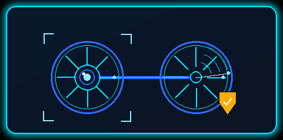
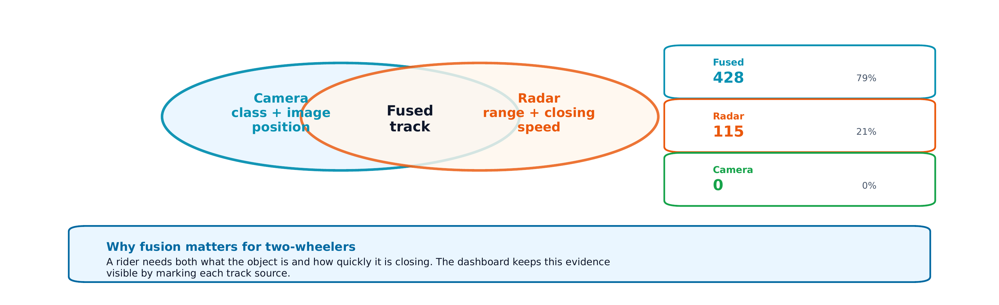
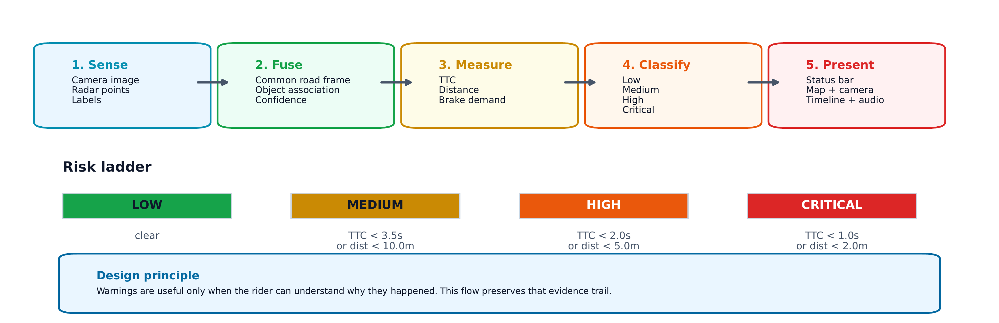
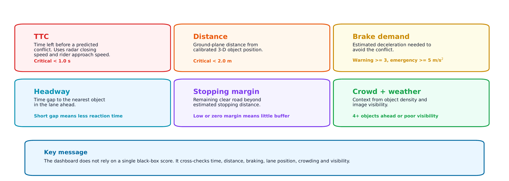
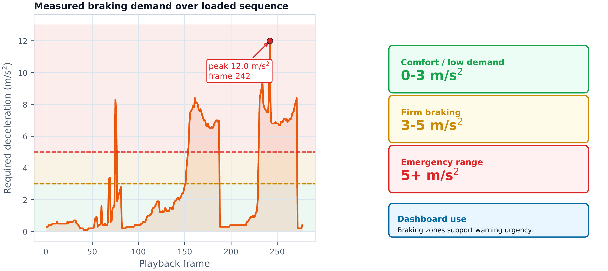
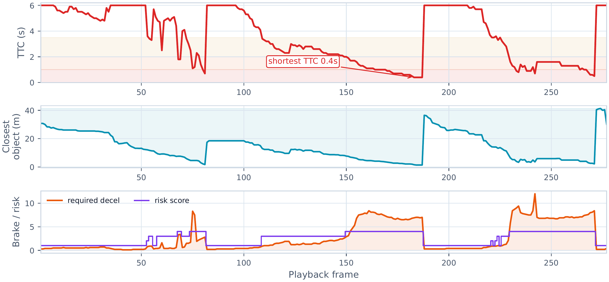
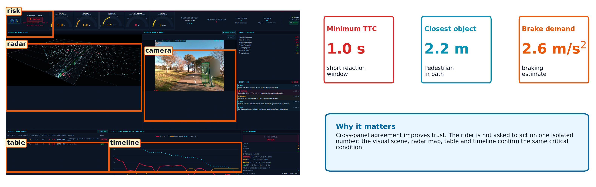

<p align="center">
  
</p>

# Two-Wheeler Safety Dashboard

Browser dashboard for **two-wheeler road safety** research. It plays a [KITTI](https://www.cvlibs.net/datasets/kitti/)-style camera + radar sequence, tracks nearby road users, and shows live risk metrics (TTC, brake demand, crowding, visibility) with optional audio alerts.


### Related projects

This dashboard is part of the **Road Safety on Two-Wheelers** research line:

<table>
  <thead>
    <tr>
      <th align="left" bgcolor="#0b1525"><font color="#00e5ff">Repository</font></th>
      <th align="left" bgcolor="#0b1525"><font color="#00e5ff">Role</font></th>
    </tr>
  </thead>
  <tbody>
    <tr>
      <td bgcolor="#f6f8fa"><a href="https://github.com/ibrahim-radwan/RoadSafetyOnTwoWheelers">RoadSafetyOnTwoWheelers</a></td>
      <td bgcolor="#f6f8fa"><b>Main project</b> — overall two-wheeler road safety research</td>
    </tr>
    <tr>
      <td bgcolor="#ffffff"><a href="https://github.com/ibrahim-radwan/two-wheeler-radar-camera-annotation-tool/tree/main">two-wheeler-radar-camera-annotation-tool</a></td>
      <td bgcolor="#ffffff">Annotation tool used to label camera + radar sequences that this dashboard plays back</td>
    </tr>
  </tbody>
</table>

Annotated [KITTI](https://www.cvlibs.net/datasets/kitti/)-style exports from the annotation tool (images, labels, calib, radar) are the intended input for `data_sample/`.

---

## Features

- Forward **camera** view with detection overlays  
- **3D radar** road view (point cloud + object boxes)  
- Risk levels: **LOW · MEDIUM · HIGH · CRITICAL**  
- Gauges: Min TTC, headway, required deceleration, stop margin, crowd  
- Object table, event log, rolling TTC / risk timeline  
- Optional **audio alerts** (beeps + browser speech) after Start Monitoring  
- Default data root: project-relative **`data_sample/`**

---

## Requirements

<table>
  <thead>
    <tr>
      <th align="left" bgcolor="#0b1525"><font color="#00e5ff">Package</font></th>
      <th align="left" bgcolor="#0b1525"><font color="#00e5ff">Used for</font></th>
    </tr>
  </thead>
  <tbody>
    <tr><td bgcolor="#f6f8fa"><code>dash</code></td><td bgcolor="#f6f8fa">Web UI and callbacks</td></tr>
    <tr><td bgcolor="#ffffff"><code>plotly</code></td><td bgcolor="#ffffff">Camera, radar, gauges, timeline charts</td></tr>
    <tr><td bgcolor="#f6f8fa"><code>flask</code></td><td bgcolor="#f6f8fa">Image route (<code>/frame-image/…</code>)</td></tr>
    <tr><td bgcolor="#ffffff"><code>numpy</code></td><td bgcolor="#ffffff">Radar / geometry / metrics</td></tr>
    <tr><td bgcolor="#f6f8fa"><code>Pillow</code></td><td bgcolor="#f6f8fa">Camera frames and weather cues</td></tr>
    <tr><td bgcolor="#ffffff"><code>pytest</code></td><td bgcolor="#ffffff">Unit tests</td></tr>
  </tbody>
</table>

Install:

```bash
pip install -r requirements.txt
```

**Python 3.10+** recommended.

---

## Quick start

### 1. Install

```bash
cd twowheeler-safety-dashboard
python -m venv .venv

# Windows PowerShell
.\.venv\Scripts\Activate.ps1

pip install -r requirements.txt
```

### 2. Dataset

Put a [KITTI](https://www.cvlibs.net/datasets/kitti/)-style sequence in **`data_sample/`** (default path in `data.py`):

```text
data_sample/
  image_2/    # 00000.png, 00001.png, …
  calib/      # 00000.txt, …
  label_2/    # 00000.txt, …
  radar/      # 00000.bin, …
```

Frame IDs must match across folders. Contiguous IDs (`00000` … `N`) work best.

Sensor binaries are **gitignored**. Add your local sample before running (see `data_sample/README.md`).

Optional override:

```powershell
$env:KITTI_BASE_PATH = "D:\path\to\your_sequence"
```

### 3. Run

```bash
python app.py
```

Open [http://localhost:8050](http://localhost:8050) → **START MONITORING**.

After code changes, hard-refresh the browser (**Ctrl+Shift+R**).

---

## How the system works

Figures in `docs/figures/` (report gallery), in order:

### 1. Sensor fusion



Fused tracks when camera and radar agree; radar-only when the object is hidden on camera; camera-led when radar support is weak.

### 2. Sensors → rider alert



Detections become TTC, distance, and brake demand, then a LOW→CRITICAL decision for UI and optional sound.

### 3. Metric meanings



Plain-language cards for the main dashboard measurements.

### 4. Brake demand



Closing speed and distance converted to estimated deceleration needed to avoid a conflict.

### 5. Evidence over time



Min TTC, closest distance, and risk across consecutive frames, with thresholds marked.

### 6. Critical scene



Annotated live dashboard at a Critical moment — badge, camera, radar, table, timeline, and gauges aligned on the same hazard.

---

## Risk model

<table>
  <thead>
    <tr>
      <th align="left" bgcolor="#0b1525"><font color="#00e5ff">Level</font></th>
      <th align="left" bgcolor="#0b1525"><font color="#00e5ff">Time-to-collision</font></th>
      <th align="left" bgcolor="#0b1525"><font color="#00e5ff">Distance</font></th>
    </tr>
  </thead>
  <tbody>
    <tr>
      <td bgcolor="#ffe5e9"><b><font color="#c62828">CRITICAL</font></b></td>
      <td bgcolor="#ffe5e9">&lt; 1.0 s</td>
      <td bgcolor="#ffe5e9">&lt; 2.0 m</td>
    </tr>
    <tr>
      <td bgcolor="#fff3e0"><b><font color="#ef6c00">HIGH</font></b></td>
      <td bgcolor="#fff3e0">&lt; 2.0 s</td>
      <td bgcolor="#fff3e0">&lt; 5.0 m</td>
    </tr>
    <tr>
      <td bgcolor="#fffde7"><b><font color="#f9a825">MEDIUM</font></b></td>
      <td bgcolor="#fffde7">&lt; 3.5 s</td>
      <td bgcolor="#fffde7">&lt; 10.0 m</td>
    </tr>
    <tr>
      <td bgcolor="#e8f5e9"><b><font color="#2e7d32">LOW</font></b></td>
      <td bgcolor="#e8f5e9" colspan="2">otherwise safe on both</td>
    </tr>
  </tbody>
</table>

The **more severe** of TTC vs distance is kept. An ego-path conflict can raise the level by one step when the object is relevant.  
**Overall scene risk** = worst object risk.

**Object confidence** (table CONF column):  
`min(1.0, 0.50 + 0.05 × N)` where `N` is radar points inside the object box (minimum **50%**).

---

## Project layout

<table>
  <thead>
    <tr>
      <th align="left" bgcolor="#0b1525"><font color="#00e5ff">Path</font></th>
      <th align="left" bgcolor="#0b1525"><font color="#00e5ff">Role</font></th>
    </tr>
  </thead>
  <tbody>
    <tr><td bgcolor="#f6f8fa"><code>app.py</code></td><td bgcolor="#f6f8fa">Entry point, <code>/frame-image/</code> route</td></tr>
    <tr><td bgcolor="#ffffff"><code>layout.py</code></td><td bgcolor="#ffffff">Page layout and stores</td></tr>
    <tr><td bgcolor="#f6f8fa"><code>callbacks.py</code></td><td bgcolor="#f6f8fa">Playback, KPIs, alarms</td></tr>
    <tr><td bgcolor="#ffffff"><code>data.py</code></td><td bgcolor="#ffffff">Loading, TTC, risk, metrics</td></tr>
    <tr><td bgcolor="#f6f8fa"><code>figures.py</code></td><td bgcolor="#f6f8fa">Plotly camera / radar / gauges</td></tr>
    <tr><td bgcolor="#ffffff"><code>playback_cache.py</code></td><td bgcolor="#ffffff">Prefetch of frame figure bundles</td></tr>
    <tr><td bgcolor="#f6f8fa"><code>assets/</code></td><td bgcolor="#f6f8fa">CSS and brand logo (<code>logo.gif</code> / <code>logo.png</code>)</td></tr>
    <tr><td bgcolor="#ffffff"><code>docs/figures/</code></td><td bgcolor="#ffffff">README gallery images</td></tr>
    <tr><td bgcolor="#f6f8fa"><code>data_sample/</code></td><td bgcolor="#f6f8fa">Local sequence (binaries gitignored)</td></tr>
    <tr><td bgcolor="#ffffff"><code>tests/</code></td><td bgcolor="#ffffff">Risk / confidence unit tests</td></tr>
    <tr><td bgcolor="#f6f8fa"><code>requirements.txt</code></td><td bgcolor="#f6f8fa">Dependencies</td></tr>
  </tbody>
</table>

---

## Tests

```bash
python -m pytest tests/ -q
```

---

## Configuration

<table>
  <thead>
    <tr>
      <th align="left" bgcolor="#0b1525"><font color="#00e5ff">Variable</font></th>
      <th align="left" bgcolor="#0b1525"><font color="#00e5ff">Default</font></th>
      <th align="left" bgcolor="#0b1525"><font color="#00e5ff">Meaning</font></th>
    </tr>
  </thead>
  <tbody>
    <tr>
      <td bgcolor="#f6f8fa"><code>KITTI_BASE_PATH</code></td>
      <td bgcolor="#f6f8fa"><code>./data_sample</code></td>
      <td bgcolor="#f6f8fa"><a href="https://www.cvlibs.net/datasets/kitti/">KITTI</a>-style dataset root (absolute or relative)</td>
    </tr>
    <tr>
      <td bgcolor="#ffffff"><code>DASHBOARD_PORT</code></td>
      <td bgcolor="#ffffff"><code>8050</code></td>
      <td bgcolor="#ffffff">HTTP port</td>
    </tr>
  </tbody>
</table>

---

## Notes

- Audio needs a user gesture (browser policy); enable it on the start screen or with the Alarm toggle.  
- The radar panel uses Plotly WebGL (interactive plot config).

---

## License / attribution

Research dashboard for the [Road Safety on Two-Wheelers](https://github.com/ibrahim-radwan/RoadSafetyOnTwoWheelers) project.  
Sequence labelling is supported by the [two-wheeler radar–camera annotation tool](https://github.com/ibrahim-radwan/two-wheeler-radar-camera-annotation-tool/tree/main).
